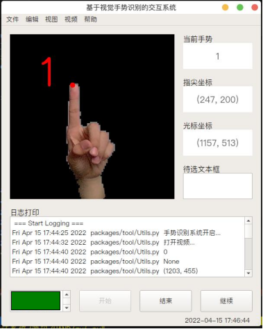

### Introduction

The main function of this system is to interact with the system through gesture recognition. There are also additional features such as video playback, log printing, etc., with the aim of assisting users in retracing historical actions. Gesture recognition is achieved through a convolutional neural network, utilizing the structure of ResNet50. Slight modifications were made to adapt to the project's needs. A custom-built dataset was used, consisting of ten categories (0-9), totaling around 5000 images of dimensions approximately 650x650.



### Installation

```bash
git https://github.com/whao22/Gesture-Interaction.git
cd Gesture-Interaction
pip install -r requirements.txt
# Download the weightfile and place it in the "resources/checkpoints" directory.

bash AppSystem.sh
```

### Pre-trained

Please download the [weightfile](https://drive.google.com/drive/folders/1hxzhYrLdi3kir7EUl7uBpMaTfOKcI9RT?usp=sharing), and place the file named "best-10.pt" in the "resources/checkpoints/" directory.

### Train

Please download the data from [this link](https://drive.google.com/drive/folders/1bwPzxeHKcwcehEmTaXwqDyRfiZ417pvr?usp=sharing) for training purposes. The training script can be found in the "packages/model" directory.


